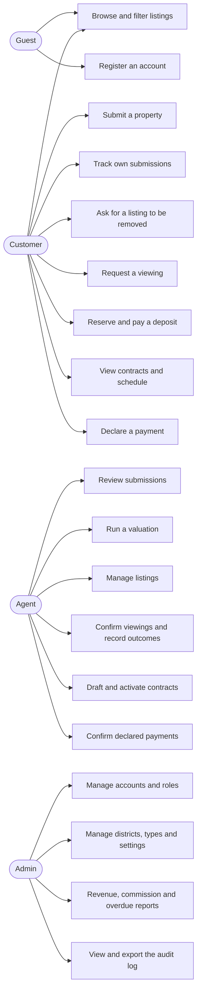
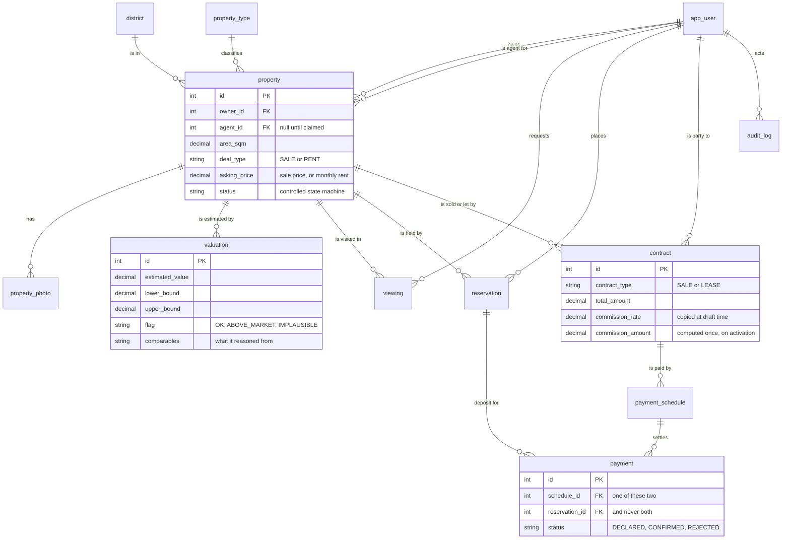
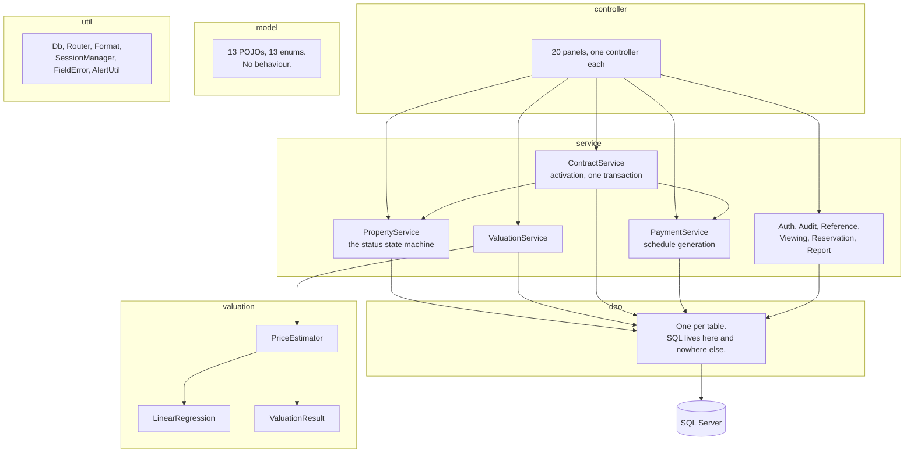
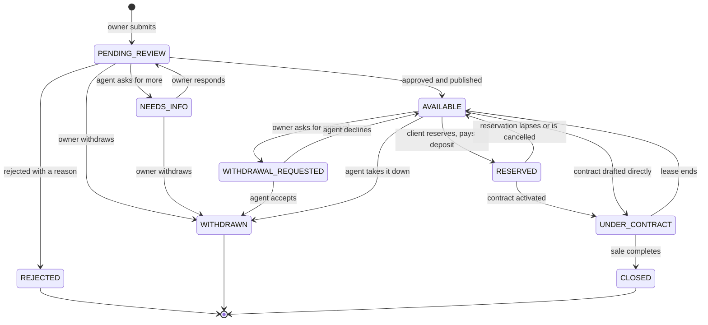
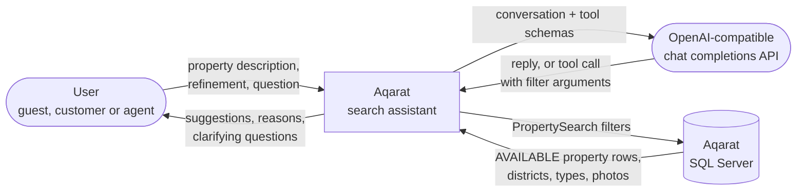

# Diagrams

Five views of the same system: who uses it, what it stores, how the code is arranged, how a
property moves through its life, and what crosses the boundary when the search assistant runs.

They are written as Mermaid rather than exported from a drawing tool, so a change to the
design is a change to this file — a diagram that has to be re-exported by hand is a diagram
that goes stale.

---

## 1. Use cases

An admin can do everything an agent can; the arrows above show only what is theirs alone.
Whether a customer is an owner or a client is answered by their relationships, not by a
column, which is why one actor points at both sets.

---

## 2. Entity relationships

`property.asking_price` carries two meanings: the full sale price when `deal_type` is
`SALE`, the monthly rent when it is `RENT`. Every read checks the deal type first.

Two rules the database enforces itself, with filtered unique indexes: one active reservation
per property, and no two confirmed viewings for one agent at one moment.

---

## 3. Classes and layers

The arrows only ever point downwards. A controller never reaches a DAO, a DAO never holds a
business rule, and the `valuation` package never touches a connection — `PriceEstimator`
takes a list of comparables and returns a result, which is what lets its tests run with no
database at all.

---

## 4. Property lifecycle

`property.status` moves only through `PropertyService`. No screen writes the column.

Two of these transitions are decided when a row is **read**, not by a timer: a reservation
past its expiry, and a schedule row past its grace period. There is no scheduler in this
system, deliberately — a background thread in a desktop application is a source of bugs, and
a read-time answer is still correct after the application has been closed for a month.

---

## 5. Search assistant, data flow

The context-level view. The processes inside the assistant, and the use cases it serves, are in
[`docs/ai-agent/DIAGRAMS.md`](ai-agent/DIAGRAMS.md).

The flow to the model carries the conversation and the two tool schemas, and nothing else. Owner
identity, internal notes, review notes and valuations never cross that boundary, because a guest
is not entitled to see them and the reliable way to guarantee that is to never send them.

The flow back carries either prose or a set of filter arguments. It never carries SQL, and it
never carries a price or an address that the application will then display — every figure on a
result card is read from the database row.
