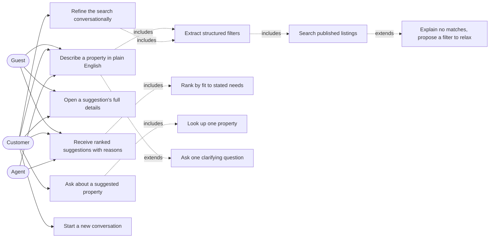
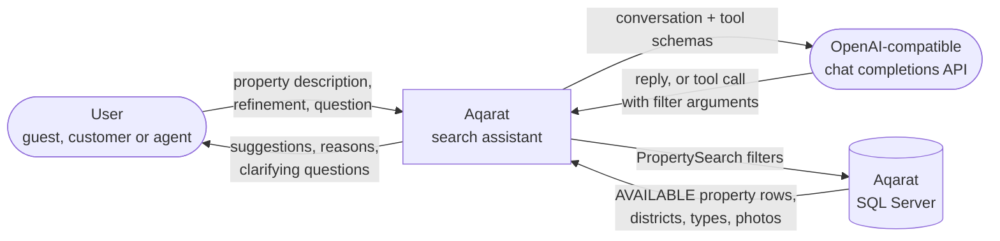
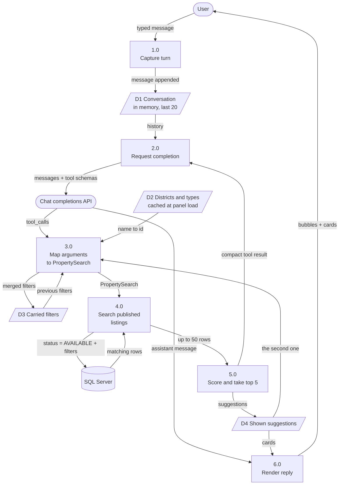

# Diagrams — conversational property search assistant

Three views: who uses the assistant, what crosses its boundary, and what happens inside it.

Written as Mermaid rather than exported from a drawing tool, matching `docs/DIAGRAMS.md`. A
diagram that has to be re-exported by hand is a diagram that goes stale.

---

## 1. Use cases

Every use case here is a read. No actor reaches one that writes, which is the whole point: the
assistant advises and a person decides.

An agent gets the panel as well, because the same conversation is a fast way to check what is on
the books while a client is on the phone. Nothing about the feature is agent-specific, so there is
no separate agent use case.

The dashed `includes` edges are the steps that always happen; the dashed `extends` edges are the
two that happen only in particular conditions — a request too vague to search, and a search that
matched nothing.

---

## 2. Data flow, level 0 — context

Two external entities and one data store.

The flow worth reading carefully is the one to the language model. It carries the conversation and
the two tool schemas, and nothing else. Owner identity, internal notes, review notes and valuations
never cross that boundary, because guests are not entitled to see them and the reliable way to
guarantee that is to never send them.

The flow back carries either prose or a set of filter arguments. It never carries SQL, and it never
carries a price or an address that the application will display.

---

## 3. Data flow, level 1 — inside the assistant

Processes 2.0 and 3.0 form the loop, capped at three passes per user turn.

Two of the four stores exist for a specific behaviour and are worth naming:

- **D3, carried filters,** is what makes "cheaper" work. The new filter set is merged onto the
  previous one rather than replacing it, so a refinement never silently loses the location the user
  gave two turns ago.
- **D4, shown suggestions,** is what makes "the second one" resolvable. Without it the model would
  have to be trusted to remember which property was second, and it would eventually be wrong about
  a real listing.

Process 4.0 binds the status itself. `AVAILABLE` is not a value that arrives from process 3.0, so
no filter argument the model produces can widen what the search returns.
